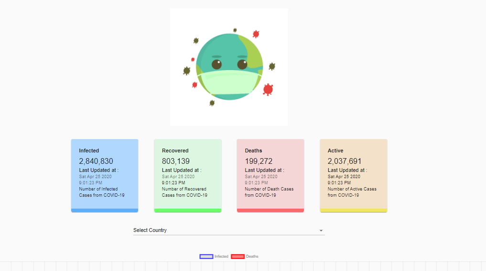
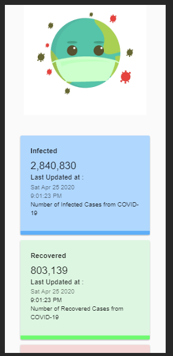

# CoronaTracker

## Introduction

The above project is small display of the dashboards of the coronavirus cases. The above website demonstrates the 4 parameters(Infected, Recovered, Deaths, Active). It demonstrtaes global cases and also country wise cases.

## Tech Stack used:
-React
-Charts.JS 
-Material UI .
-HTML & CSS

API Used -  https://covid19.mathdro.id/api

---

